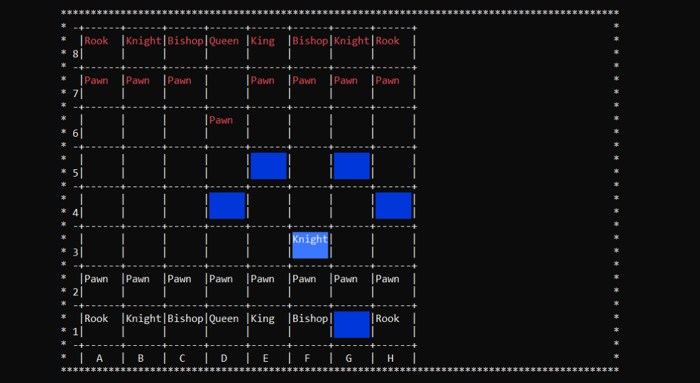
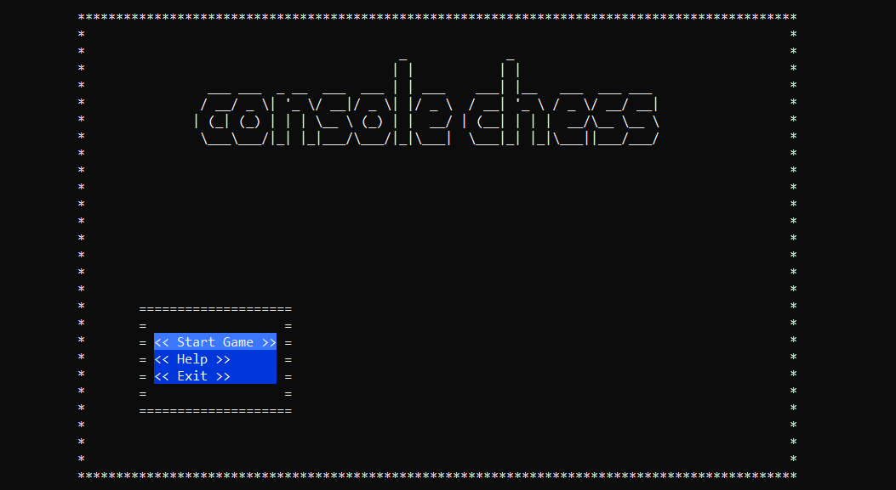

# C# Chess Game

This project is a C# implementation of player-Vs-player chess game. The implementation was created as a university project by Kamil Zych.
## Known Bugs:

 - No Enpesant Pawn Rule
## Screenshots:

